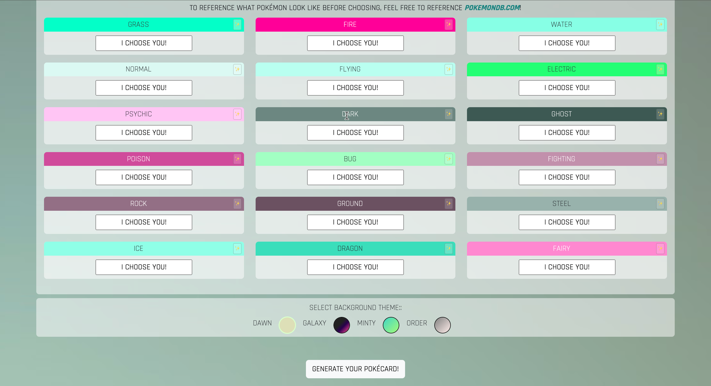
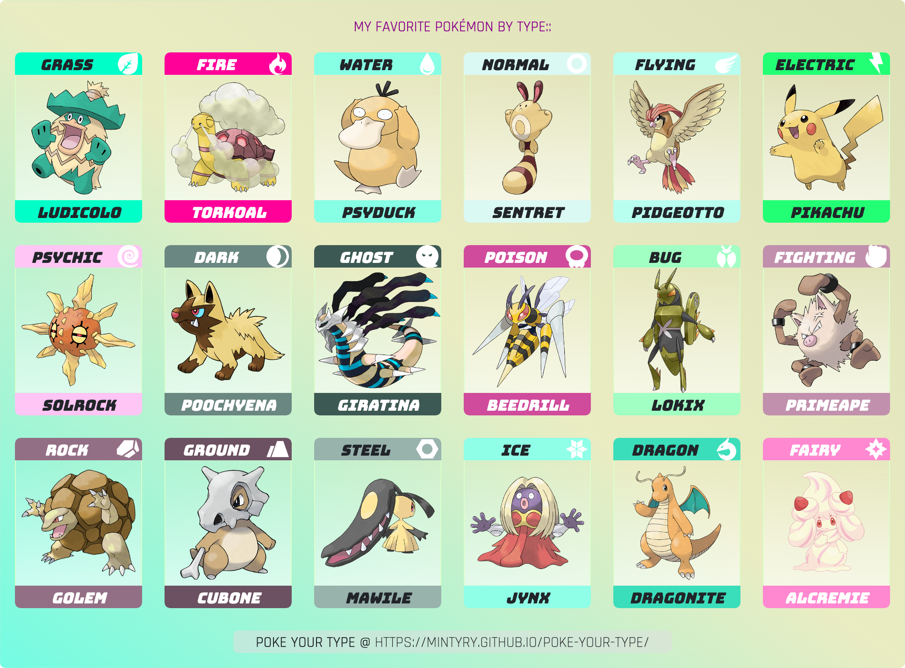
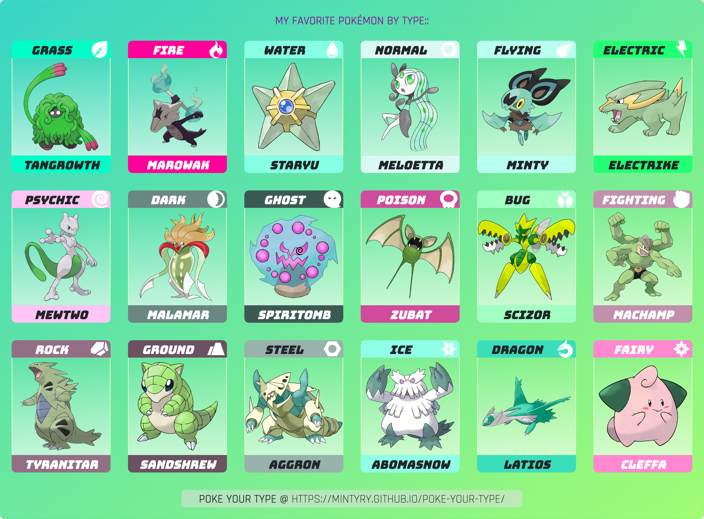
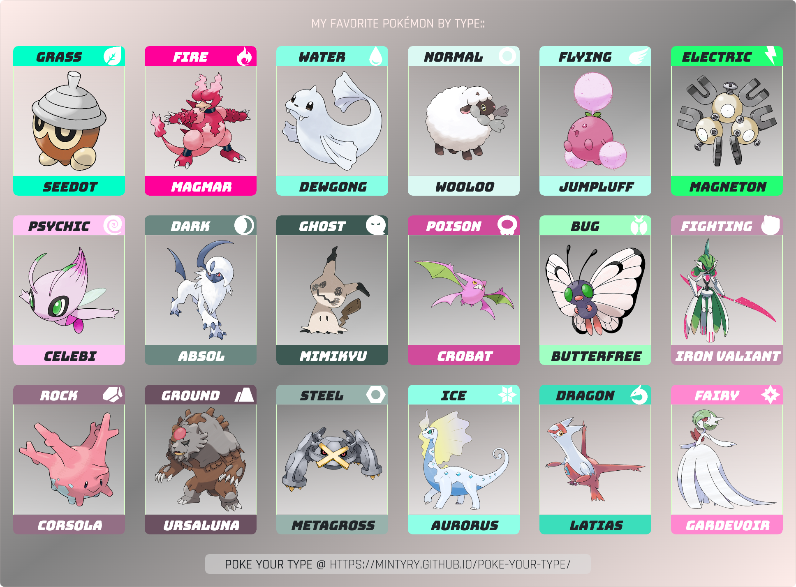

# Poke-Your-Type

## Description 📰
Poke Your Type is a card generator showcasing your favorite Pokémon by each type.

For those uninitiated, Pokémon is essentially a game of rock-paper-scissors meets chess. But imagine if rock-paper-scissors had 18 different options. These are what Pokémon types are. Grass beats water, water beats fire, fire beats grass, and so on.

I recently finished a software development program, and I wanted to practice the basic fundamentals with HTML, CSS, and JavaScript. I was inspired by centropkmn.com to make a similar app that they have -- generate a card of your favorite Pokémon by type. The thing was, as a fan of that generator app, there were things I've always wished I could "improve." I believe this app solves the issues I had with the original app:

- For one thing, the centropkmn app was often down, so anytime I wanted to generate a card, I couldn't. The site was too inconsistent -- at the time I began making Poke Your Type, centropkmn was not up anymore, and I had no idea if it would be coming back, so I decided I would make my own.

- Now that they are back up, the card that is generated is in a vertical column, which I do not prefer, because I like to share these cards via text or social media, and long vertical images are not eye-friendly, so i made a horizontal-oriented card.

- Their site is mainly in Spanish. Sometimes, I am not able to convert it to English, sometimes I can. The inconsistency also drove me to make an English app.

- Their generator is very kid-friendly, and I wanted a more clean aesthetic that could appeal to a wider demographic and be pleasing to the eye.

Additionally, I added features I wanted to see in this app: making Pokémon shiny and being able to customize the background of the card a bit.

Beyond the issues and solutions I just listed from the aforementioned site, this app also solves the issue of a more streamlined favorite pokemon card creator. There are a few other apps out there, but none of them achieve what I've been looking for: being able to share on social media -- and do it easily. This app has an easy selection with a straight-forward approach that produces a card that has straight-forward readability -- nothing too convoluted or random.

Although this app is rooted in basic HTML, CSS, and JavaScript, I still managed to learn a lot! I learned how to use html2canvas, along with the intricacies of CORS headers and browser security and how to still make fetched images show at the end of it all.

I learned more about how to handle issues that arise from deployment (deployment will probably the bane of me). Basically, you can preview your app to death, but you can't know 100% that everything will be as they seem until they are deployed, especially when it comes to mobile experiences.

I also learned a bit more about adding event listeners, how you can and cannot do so, as well as coming up with logic to remove individually-added event listeners that were created in bulk.

While this started out as a personal project to gain more practice, it has definitely evolved into a personal passion project that I am proud of, and I hope you enjoy!

## Table of Contents

&nbsp;&nbsp;&nbsp;&nbsp;&nbsp;&nbsp; ➣ [Installation](#Installation)

&nbsp;&nbsp;&nbsp;&nbsp;&nbsp;&nbsp; ➣ [Usage](#Usage)

&nbsp;&nbsp;&nbsp;&nbsp;&nbsp;&nbsp; ➣ [Contributing](#Contributing)

&nbsp;&nbsp;&nbsp;&nbsp;&nbsp;&nbsp; ➣ [Tests](#Tests)

&nbsp;&nbsp;&nbsp;&nbsp;&nbsp;&nbsp; ➣ [Credits](#Credits)

&nbsp;&nbsp;&nbsp;&nbsp;&nbsp;&nbsp; ➣ [Questions](#Questions)

## Installation 🔌

`N/A`

## Usage 🧮

You can find the [Poke Your Type app here](https://mintyry.github.io/poke-your-type/)!

User must select pokemon names from their respective dropdown lists.

In this app, user can toggle the images to display the Pokémon in their shiny (rarer/alternate) color palette or not.

User can also select what background color their final card will be.
  
    
DEFAULT THEME FOR POKÉCARD - DAWN THEME

  
    
POKÉCARD - GALAXY THEME

  
    
POKÉCARD - MINTY THEME

  
    
POKÉCARD - ORDER THEME

Additionally, as a little personal Easter egg, I made it so if a user selects a shiny Noibat, the name will appear as "Minty," as that was the nickname I gave my shiny Noibat in Pokémon Violet -- a Pokémon that is dear to me.

The preview of what the card will look like is underneath the "Generate your Pokécard" button.

Once user clicks the Generate button, they will initiate a download of the card.
A text will briefly pop up to explain that your image will be in your specified downloads folder.
This was added because I realized on mobile iOS, there is not reliable feedback provided to the user that their file had been downloaded, since this is a programatically generated image file.

Additionally, those who are dev-inclined and curious to seek my other work can click a rather ambiguous link at the bottom of my page to view my portfolio, or they can open up console in dev tools to find a link to my portfolio.

Once user has saved their image, they can share on any platform they like, via text or social media! Have fun with it!

## Contributing 🍴

In order to contribute, one must fork their repository and create a pull request.

## Tests ⚖️

`N/A`.

 ## Credits 🤝
  pokeAPI for most fetched images.

## Questions 📭

Please enjoy my work at my GitHub, @[mintyry](https://github.com/mintyry).

Please feel free to message me here to let me know of any bugs as well as any improvements you would like to see!

